# Delivery Status Workflow Refactor Plan

## Goals

- **Single owner of final delivery**: Only the **delivery boy** can mark a shipment/order as `delivered`, always via **OTP confirmation**.
- **Clear role responsibilities**: Vendors, logistics, delivery boys, and customers each have a well-defined subset of status transitions.
- **Consistent data model**: Shipment and order statuses, OTP codes, and payment status remain consistent and auditable across the system.
- **Minimal UI confusion**: Remove misleading "delivered" options from vendor and logistics UIs so the workflow is obvious to users.

## Current Behavior (Summary)

- **Enums and models** (in backend `app/models.py`):
  - `OrderStatus = pending, confirmed, packed, shipped, delivered, cancelled, returned`.
  - `ShipmentStatus = pickup_requested, picked, in_transit, out_for_delivery, delivered, failed`.
  - `Shipment` already stores `otp_code`, `delivery_attempts`, `failure_reason`, times, and assignment fields.
- **Back-end routes**:
  - Vendor (`app/vendor_portal/routes.py`):
    - `PATCH /vendor/orders/<order_id>/status` can set order status to `{confirmed, packed, shipped, delivered, cancelled}` and, when set to `delivered`, also updates `payment_status` and COD settlement.
  - Logistics (`app/logistics/routes.py`):
    - `PATCH /logistics/shipments/<shipment_id>/status` can set shipment status to any of `{pickup_requested, picked, in_transit, out_for_delivery, delivered, failed}`; when `delivered`, requires OTP and also sets order to `delivered`.
  - Delivery boy (`app/delivery/routes.py`):
    - `PATCH /delivery/shipments/<shipment_id>/status` allows `{picked, in_transit, out_for_delivery, failed}` (explicitly **forbids** `delivered`).
    - `POST /delivery/shipments/<shipment_id>/confirm` uses OTP to set shipment and order to `delivered`.
  - Customer (`app/orders/routes.py`):
    - `POST /orders` creates order + shipment with OTP; `POST /orders/<order_id>/cancel` cancels early orders.
- **Front-end UIs**:
  - Vendor (`frontend/src/workspaces/vendor/VendorOrdersPage.jsx`): dropdown with statuses `[confirmed, packed, shipped, delivered, cancelled]` calling `PATCH /vendor/orders/<id>/status`.
  - Logistics (`frontend/src/workspaces/logistics/LogisticsShipmentsPage.jsx`): dropdown `[picked, in_transit, out_for_delivery, delivered, failed]` calling `PATCH /logistics/shipments/<id>/status`; when choosing `delivered`, prompts for OTP.
  - Delivery boy (`frontend/src/workspaces/delivery/DeliveryShipmentsPage.jsx`, `DeliveryShipmentDetailPage.jsx`): can set non-final statuses and has a dedicated **"Confirm delivery (OTP)"** form calling `POST /delivery/shipments/<id>/confirm`.
  - Customer (`frontend/src/workspaces/customer/CustomerOrdersPage.jsx`): displays order + shipment status and shows the OTP, but cannot change status.

## Target Workflow

### Role Responsibilities

- **Vendor**
  - Manage **order preparation** only:
    - Allowed transitions: `pending → confirmed → packed → shipped` (and possibly `cancelled` before `shipped`).
    - **Cannot** set `delivered` or manipulate shipment-level statuses.
  - COD settlement should **not** be triggered directly by vendor setting `delivered`.
- **Logistics**
  - Manage **shipment assignment and dispatch**, not final delivery:
    - Allowed transitions: `pickup_requested → picked → in_transit → out_for_delivery` and optionally `failed` for pre-assignment failures.
    - **Cannot** set `delivered`.
    - Responsible for assigning delivery boy and ensuring shipments reach `out_for_delivery` with a driver.
- **Delivery Boy**
  - Manage **last mile** delivery:
    - Allowed non-final transitions: `pickup_requested/picked/in_transit/out_for_delivery/failed` according to existing rules.
    - Only role that can confirm final delivery via **OTP**:
      - Uses `POST /delivery/shipments/<shipment_id>/confirm` with OTP (and optional proof) to set shipment and order to `delivered` and confirm COD payment.
- **Customer**
  - Can:
    - Place orders, view all statuses, and see the OTP.
    - Cancel only in early states (`pending` or `confirmed`).
  - Cannot change shipment/order status after checkout.

### High-Level Status Flow (Mermaid)

```mermaid
flowchart LR
  customer[Customer] -->|places order| orderPending[Order pending]
  orderPending -->|vendor confirms| orderConfirmed[Order confirmed]
  orderConfirmed -->|vendor packs| orderPacked[Order packed]
  orderPacked -->|vendor ships| orderShipped[Order shipped]
  orderShipped -->|shipment created| shipmentPickupRequested[Shipment pickup_requested]
  shipmentPickupRequested -->|logistics picks| shipmentPicked[Shipment picked]
  shipmentPicked -->|logistics/driver moves| shipmentInTransit[Shipment in_transit]
  shipmentInTransit -->|dispatcher sets| shipmentOFD[Shipment out_for_delivery]
  shipmentOFD -->|customer sees OTP| otpShown[OTP visible]
  shipmentOFD -->|delivery boy + OTP| deliveredFinal[Order+Shipment delivered]
```

## Back-End Changes

### 1. Vendor order status endpoint

- **File**: `[backend/app/vendor_portal/routes.py](backend/app/vendor_portal/routes.py)`
- **Changes**:
  - Restrict `VALID_VENDOR_ORDER_STATUS` to **exclude** `delivered` (and optionally tighten `cancelled` rules to only early stages).
  - Remove or refactor logic that:
    - Sets `order.payment_status = PaymentStatus.COD_CONFIRMED` when vendor marks `delivered`.
    - Calls `mark_cod_confirmed(order.id)` from the vendor path.
  - Optionally enforce allowed transitions server-side (not just allowed target statuses), e.g. disallow `pending → shipped` directly.

### 2. Logistics shipment status endpoint

- **File**: `[backend/app/logistics/routes.py](backend/app/logistics/routes.py)`
- **Changes**:
  - Restrict `VALID_SHIPMENT_STATUS` for `/logistics/shipments/<id>/status` to **exclude** `delivered`.
  - In the update handler:
    - If a request attempts to set `status == delivered`, return a `400` or `422` with an explanation ("Final delivery must be confirmed by delivery boy with OTP").
    - Remove OTP-handling logic (prompt, validation, and `otp` field consumption) from logistics endpoint.
  - Keep logic that:
    - Updates `order.order_status = OrderStatus.SHIPPED` on `picked/in_transit/out_for_delivery` as appropriate.
    - Allows `failed` only when shipment is not yet in final states (guard against inconsistent transitions).

### 3. Delivery boy shipment endpoints

- **File**: `[backend/app/delivery/routes.py](backend/app/delivery/routes.py)`
- **Changes**:
  - Keep `PATCH /delivery/shipments/<id>/status` as the sole API for non-final driver updates (`picked`, `in_transit`, `out_for_delivery`, `failed`).
  - Ensure final confirmation logic in `POST /delivery/shipments/<id>/confirm` is the **single** place that can:
    - Set `shipment.shipment_status = ShipmentStatus.DELIVERED`.
    - Set `order.order_status = OrderStatus.DELIVERED`.
    - Increment `delivery_attempts` appropriately on failure paths.
  - **Add COD confirmation here**:
    - When OTP is valid and shipment is delivered, update `order.payment_status` from `cod_pending` to `cod_confirmed` (or equivalent), and invoke any COD settlement function (currently `mark_cod_confirmed(order.id)`).
  - Consider adding rate limits or lockouts after too many failed OTP attempts, using `delivery_attempts` as part of the rule.

### 4. OTP lifecycle (optional hardening)

- **Files**: `[backend/app/orders/routes.py](backend/app/orders/routes.py)`, `[backend/app/models.py](backend/app/models.py)`
- **Improvements (not strictly required but recommended)**:
  - Add an `otp_expires_at` field on `Shipment` or derive expiry from creation time.
  - On order creation, set a reasonable OTP TTL (e.g. several hours or until delivery window end).
  - In `delivery.confirm_delivery`, reject OTP if expired and set shipment to `failed` with appropriate `failure_reason`, or require re-dispatch.
  - Optionally mask or avoid returning `otp_code` via admin/logistics APIs; only customer and delivery boy flows actually need to know/verify it.

### 5. Consistency and auditing

- **Files**: shipment/order services and models
- **Actions**:
  - Double-check that every path that sets `ShipmentStatus.DELIVERED` also sets `OrderStatus.DELIVERED` and COD payment status consistently.
  - Ensure no remaining code path (admin tools, background jobs) can mark a shipment or order delivered without going through OTP logic.
  - Add structured audit logging around `delivered` and `failed` transitions with:
    - Responsible role (`delivery_boy` vs others).
    - Shipment ID, order ID, timestamp.

## Front-End Changes

### 1. Vendor orders page

- **File**: `[frontend/src/workspaces/vendor/VendorOrdersPage.jsx](frontend/src/workspaces/vendor/VendorOrdersPage.jsx)`
- **Changes**:
  - Update `STATUS_OPTIONS` to remove `"delivered"` so vendor cannot select it from the dropdown.
  - Optionally adjust UI copy to clarify vendor responsibilities (e.g. tooltip or help text explaining that final delivery is confirmed by delivery boy with OTP).
  - Ensure UI gracefully handles orders whose status is already `delivered` (display only, no editable dropdown).

### 2. Logistics shipments page

- **File**: `[frontend/src/workspaces/logistics/LogisticsShipmentsPage.jsx](frontend/src/workspaces/logistics/LogisticsShipmentsPage.jsx)`
- **Changes**:
  - Update `STATUS_OPTIONS` for the "Update status" dropdown to **exclude** `"delivered"` so logistics cannot attempt final delivery.
  - Remove the logic that prompts for OTP when `status === "delivered"` and stops sending OTP in logistics `updateShipmentStatus` payloads.
  - Keep or refine status filters so `delivered` shipments can still be viewed in read-only fashion.
  - Optional UX improvements:
    - Visually separate logistics-controlled phases (up to `out_for_delivery`) from the final phase that is owned by the delivery boy.

### 3. Delivery boy pages

- **Files**: `[frontend/src/workspaces/delivery/DeliveryShipmentsPage.jsx](frontend/src/workspaces/delivery/DeliveryShipmentsPage.jsx)`, `[frontend/src/workspaces/delivery/DeliveryShipmentDetailPage.jsx](frontend/src/workspaces/delivery/DeliveryShipmentDetailPage.jsx)`
- **Changes**:
  - Confirm that only non-final status options are available in `STATUS_OPTIONS` (`picked`, `in_transit`, `out_for_delivery`, `failed`).
  - Keep the existing **"Confirm delivery (OTP)"** panel as the sole way to finalize deliveries.
  - After a successful confirm, ensure UI:
    - Updates the local shipment to `delivered`.
    - Disables further status changes on that shipment.

### 4. Customer orders page

- **File**: `[frontend/src/workspaces/customer/CustomerOrdersPage.jsx](frontend/src/workspaces/customer/CustomerOrdersPage.jsx)`
- **Changes**:
  - Confirm OTP visibility and messaging:
    - Customer should see OTP when shipment is `out_for_delivery`.
    - Optionally hide or de-emphasize OTP after delivery is complete.
  - Ensure order timeline visually reflects the updated ownership:
    - Vendor steps: pending → confirmed → packed → shipped.
    - Logistics/delivery steps: pickup_requested → picked → in_transit → out_for_delivery → delivered.

## Testing Strategy

### 1. Unit tests (backend)

- **Vendor**
  - Verify `PATCH /vendor/orders/<id>/status` rejects `status = delivered`.
  - Verify vendor can still progress `pending → confirmed → packed → shipped` under normal conditions.
- **Logistics**
  - Verify `PATCH /logistics/shipments/<id>/status` rejects `status = delivered` with a clear error.
  - Verify valid transitions up to `out_for_delivery` still work and keep order status synced to `shipped` where appropriate.
- **Delivery boy**
  - Verify `PATCH /delivery/shipments/<id>/status` cannot set `delivered` but can set non-final statuses, respecting ownership checks.
  - Verify `POST /delivery/shipments/<id>/confirm`:
    - Succeeds with correct OTP, setting shipment and order to `delivered` and confirming COD payment.
    - Fails with incorrect OTP, does **not** set delivered, and optionally increments `delivery_attempts`.

### 2. Integration tests (end-to-end API flows)

- End-to-end scenario:
  1. Customer places COD order.
  2. Vendor moves order to `confirmed`, `packed`, `shipped`.
  3. Logistics assigns shipment to a delivery boy and moves status through `pickup_requested → picked → in_transit → out_for_delivery`.
  4. Customer sees OTP in order details.
  5. Delivery boy retrieves the shipment, sets `in_transit → out_for_delivery` as needed, then calls `/confirm` with the OTP.
  6. Verify shipment and order are `delivered`, COD payment is confirmed, and vendor/logistics UIs show delivered as read-only.
- Negative scenarios:
  - Logistics or vendor attempts to set `delivered` and receives a 4xx error.
  - Delivery boy attempts to confirm with wrong OTP; verify status remains non-delivered and error message is clear.

### 3. Front-end tests / manual QA

- Verify **VendorOrdersPage** no longer offers `delivered` in the dropdown and still works for other statuses.
- Verify **LogisticsShipmentsPage** no longer shows `delivered` in the update dropdown and never asks for OTP.
- Verify **DeliveryShipmentDetailPage** is the only place where OTP is entered and that successful confirmation updates UI appropriately.
- Verify **CustomerOrdersPage** shows OTP at `out_for_delivery` and that, after delivery, both order and shipment timelines show `delivered` with no way to change it from the UI.

## Risks and Mitigations

- **Legacy data with delivered shipments**: Logistics/admin may expect to be able to adjust delivered shipments.
  - Mitigation: keep a read-only view for delivered shipments and, if needed, add a separate admin-only remediation path that logs every override.
- **COD settlement change**: Moving COD confirmation from vendor to delivery may affect financial reports.
  - Mitigation: cross-check backend payment-related code and adjust reports to treat delivery confirmation as the payment confirmation event.
- **User confusion during rollout**: Existing operators may be used to setting `delivered` in logistics.
  - Mitigation: update UI labels and possibly display a banner/tooltips in the logistics workspace explaining the new process.

